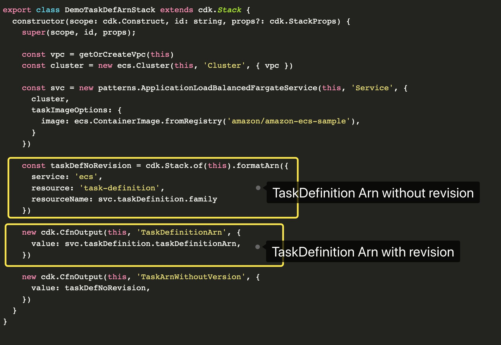

Thanks to Intellisense and type safety, working with constructs in the CDK is pretty easy. Just start typing and you've
a got wealth of information on how to use the particular construct (yay strongly typed languages!).


But what happens when that's not enough? It can be hard to find the right function calls to wire together.

The following are a number of useful helper functions you can use to get the job done.

## Stack

### static of(construct) [docs](https://docs.aws.amazon.com/cdk/api/latest/docs/@aws-cdk_core.Stack.html#static-ofconstruct)

`Stack.of` can be handy when you're deep inside a construct tree and you want to get information about the Stack itself:

```typescript
new Pipeline(this, `${Stack.of(this).stackName}-cicd`, {
    stages: [
        {
            stageName: 'get',
            actions: [this.githubSourceAction]
        },
        {
            stageName: 'build',
            actions: [this.buildAction]
        },
        {
            stageName: 'deploy',
            actions: [this.deployAction]
        }
    ]
})
```

### formatArn [docs](https://docs.aws.amazon.com/cdk/api/latest/docs/@aws-cdk_core.Stack.html#format-wbr-arncomponents)

Sometimes you need to generate an Arn and can't just use ones given to you by constructs. For example, when working
with ECS the Arn provided by the task definition has a revision number on it:


Image courtesy of [@phadut](https://twitter.com/pahudnet/status/1270173073543593984).

Don't use string concatenation, use helpers! Stack has a helper that will automatically fill in some values for you:

```typescript
resources: [
    `${this.props.ecsStack.apiRepository.repositoryArn}`,
    Stack.of(this.props.ecsStack.apiRepository).formatArn({
      resource: '*',
      service: 's3'
    })
]
```

If you don't have a stack, you can use the helper on the Arn class directly:

```typescript
const arn = Arn.format(
    {
        resource: "instance",
        service: "ec2",
        resourceName: instance.ref,
    },
    instance.stack);
```
[source](https://github.com/tecracer/cdk-templates/blob/master/ec2-autostop/lib/ec2-target.ts)

In this case, `instance.stack` can be undefined, but only if all the other components are supplied.

## IAM Policies

### Don't write your own (*unless you have to)

Sometimes you have to construct your own IAM policy:

```typescript
const taskExecutionRolePolicyStatement = new iam.PolicyStatement({
  effect: iam.Effect.ALLOW,
  actions: [
    'iam:PassRole',
  ],
  resources: [
    taskDefinition.obtainExecutionRole().roleArn,
    taskDefinition.taskRole.roleArn,
  ]
});
extractLambda.addToRolePolicy(taskExecutionRolePolicyStatement);
```
[source](https://github.com/cdk-patterns/serverless/blob/master/the-eventbridge-etl/typescript/lib/the-eventbridge-etl-stack.ts)

But often it's better to use the various `.grantXXXsdfasdfadf` helpers:

```typescript
new dynamo.Table(...).grantReadWriteData(someLambda);
```

In this case, the `someLambda` function will get access to read and write data from the new Table. No concern
about what policies you need or anything.

### Reference managed policies

You can also easily reference existing managed policies:

```typescript
iam.ManagedPolicy.fromAwsManagedPolicyName(
  "service-role/AWSLambdaBasicExecutionRole"
)
```

## S3 Object Arns

You often need a resource Arn for objects in an S3 Bucket. The Bucket construct has a handy function for this.

```typescript
bucket.arnForObjects("*")
```
[source](https://github.com/tecracer/cdk-templates/blob/master/codepipeline/lib/codepipeline-stack.ts)

## Fn

Fn is directly related to the [intrinsic CloudFormation helper functions](http://docs.aws.amazon.com/AWSCloudFormation/latest/UserGuide/intrinsic-function-reference.html).
You can use these in a similar manner.

```typescript
policies: [
    {
        statement: new PolicyStatement({
            actions: ['dynamodb:Batch*', 'dynamodb:DeleteItem', 'dynamodb:Get*', 'dynamodb:PutItem', 'dynamodb:UpdateItem', 'dynamodb:Query', 'dynamodb:Scan'],
            // tslint:disable-next-line:no-invalid-template-strings
            resources: [Fn.sub('arn:aws:dynamodb:${AWS::Region}:${AWS::AccountId}:table/${AttributesTable}')],
        }),
    },
],
```
[source](https://github.com/taimos/cdk-constructs/blob/master/lib/alexa/skill.ts)

## Schedule

When using CloudWatch events it's often easiest to use the `.cron` helper for strongly typed schedules:

```typescript
schedule: Schedule.cron({
    minute: '05',
    hour: '15',
    month: '*',
    weekDay: '*',
    year: '*',
})
```
[source](https://github.com/tecracer/cdk-templates/blob/master/ec2-autostop/lib/stop-instance.ts)

## Elastic Container Services

If you're working with Elastic Container Services you're likely to need a few extra helpers along the way:

### obtainExecutionRole()

```typescript
taskDefinition.obtainExecutionRole().roleArn
```
[source](https://github.com/cdk-patterns/serverless/blob/master/the-eventbridge-etl/typescript/lib/the-eventbridge-etl-stack.ts)

### fromRegistry

```typescript
taskDef.addContainer("AppContainer", {
  image: ecs.ContainerImage.fromRegistry("amazon/amazon-ecs-sample"),
})
```
[source](https://github.com/aws-samples/aws-cdk-examples/blob/master/typescript/ecs/fargate-service-with-logging/index.ts)

### Placement Strategies

```typescript
service.addPlacementStrategies(
  ecs.PlacementStrategy.packedBy(ecs.BinPackResource.MEMORY),
  ecs.PlacementStrategy.spreadAcross(ecs.BuiltInAttributes.AVAILABILITY_ZONE));
```
[source](https://github.com/aws-samples/aws-cdk-examples/blob/master/typescript/ecs/ecs-service-with-task-placement/index.ts)

## EC2

Sometimes image management is a pain to get good references, check out some of the helper classes:

```typescript
const asg = new autoscaling.AutoScalingGroup(this, 'ASG', {
  vpc,
  instanceType: ec2.InstanceType.of(ec2.InstanceClass.T2, ec2.InstanceSize.MICRO),
  machineImage: new ec2.AmazonLinuxImage(),
});
```
[source](https://github.com/aws-samples/aws-cdk-examples/blob/master/typescript/application-load-balancer/index.ts)


```typescript
const asg = new autoscaling.AutoScalingGroup(this, 'MyFleet', {
  instanceType: ec2.InstanceType.of(ec2.InstanceClass.T2, ec2.InstanceSize.XLARGE),
  machineImage: new ecs.EcsOptimizedAmi(),
  updateType: autoscaling.UpdateType.REPLACING_UPDATE,
  desiredCapacity: 3,
  vpc,
});
```

## Connections and Security Groups

Many of the AWS Resources will have a `.connections` property that is an IConnectable interface.
There are some helpers here for setting up access. See more [here](https://docs.aws.amazon.com/cdk/api/latest/docs/@aws-cdk_aws-ec2.Connections.html).

```typescript
listener.connections.allowDefaultPortFromAnyIpv4('Open to the world');
```
[source](https://github.com/aws-samples/aws-cdk-examples/blob/master/typescript/classic-load-balancer/index.ts)

```typescript
ecsService.service.connections.allowFromAnyIpv4(EPHEMERAL_PORT_RANGE);
```
[source](https://github.com/aws-samples/aws-cdk-examples/blob/master/typescript/ecs/ecs-network-load-balanced-service/index.ts)

```typescript
sg.addIngressRule(Peer.ipv4(ip), Port.tcp(22), "Ssh Client incoming")
```
[source](https://github.com/tecracer/cdk-templates/blob/master/ec2-instanceconnect/lib/Vpc-stack.ts)

## Overrides

Overrides are a nice release-valve and aren't terribly common, but here are some good examples:


```typescript
const bucketResource = bucket.node.defaultChild as s3.CfnBucket;
const anotherWay = bucket.node.children.find(c => (c as cdk.CfnResource).cfnResourceType === 'AWS::S3::Bucket') as s3.CfnBucket;
```
[source](https://github.com/aws-samples/aws-cdk-examples/blob/master/typescript/resource-overrides/index.ts)

```typescript
bucketResource.node.addDependency(otherBucket.node.defaultChild as cdk.CfnResource);
bucketResource.cfnOptions.metadata = { MetadataKey: 'MetadataValue' };
bucketResource.cfnOptions.updatePolicy = {
    autoScalingRollingUpdate: {
        pauseTime: '390'
    }
};
```

## Route 53

When setting up Route53, you'll use the RecordTarget factories

```typescript
const aTarget = RecordTarget.fromIpAddresses("192.168.0.11","192.168.0.13")

const aRecord = new ARecord(this,"ARecord", {
  target: aTarget,
  comment: "Demo  Record",
  ttl: cdk.Duration.seconds(300),
  recordName: "www",
  zone: demoZone,
});
```
[source](https://github.com/tecracer/cdk-templates/blob/master/r53/lib/r53-stack.ts)


## Conclusion

A lot of the CDK API is self-explanitory. When it's not, helper functions usually fill in the gaps.

If you see any that I've missed, submit an Issue/PR on [the Github page](https://github.com/Open-Construct-Foundation/public-site)
