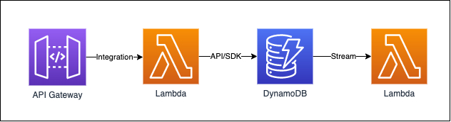

AWS just released the [Solutions Constructs](https://aws.amazon.com/solutions/constructs/), a library of vetted
L3 micro-constructs that can be used as building blocks for serverless applications. These are leveraged the same way
as the standard L2 and L3 constructs. Let's dive right in and take a look at a few:

## API Gateway to Lambda

Here is a standard setup for API Gateway to a Lambda function.


```typescript
const { ApiGatewayToLambda } = require('@aws-solutions-constructs/aws-apigateway-lambda');

new ApiGatewayToLambda(stack, 'ApiGatewayToLambdaPattern', {
    deployLambda: true,
    lambdaFunctionProps: {
        runtime: lambda.Runtime.NODEJS_10_X,
        handler: 'index.handler',
        code: lambda.Code.asset(`${__dirname}/lambda`)
    }
});
```

This creates an API Gateway endpoint that is a full proxy (`{proxy+}`) to the Lambda function it creates.

## Lambda to DynamoDB

This will create a DynamoDB Table and Lambda function to read/write to it.


```typescript
const { LambdaToDynamoDBProps,  LambdaToDynamoDB } = require('@aws-solutions-constructs/aws-lambda-dynamodb');

const props: LambdaToDynamoDBProps = {
    deployLambda: true,
    lambdaFunctionProps: {
        code: lambda.Code.asset(`${__dirname}/lambda`),
        runtime: lambda.Runtime.NODEJS_12_X,
        handler: 'index.handler'
    },
};

new LambdaToDynamoDB(stack, 'test-lambda-dynamodb-stack', props);
```

This construct also takes care of things like permissions and setting up the DynamoDB Table name in the environment
variables for the Lambda to use.

## DynamoDB to Lambda

This creates a DynamoDB table with streams enabled and a lambda as a subscriber.


```typescript
const { DynamoDBStreamToLambdaProps,  DynamoDBStreamToLambda} = require('@aws-solutions-constructs/aws-dynamodb-stream-lambda');

const props: DynamoDBStreamToLambdaProps = {
    deployLambda: true,
    lambdaFunctionProps: {
        code: lambda.Code.asset(`${__dirname}/lambda`),
        runtime: lambda.Runtime.NODEJS_12_X,
        handler: 'index.handler'
    },
};

new DynamoDBStreamToLambda(stack, 'test-dynamodb-stream-lambda', props);
```

## Wiring it all together.

Now let's go ahead and wire these together to make something useful. What we want is something like the following diagram.
I've removed things like the CloudWatch and Role pieces to simplify it.



An API Gateway endpoint that integrates with a lambda function. -->
That Lambda reads and writes to DynamoDB through the AWS sdk. -->
A second Lambda that listens to the DynamoDB stream.

This basic architecture could be used as the start of a Microservice API architecture for your next project.

Let's take a look at the code:

```typescript
import {Construct, Stack, StackProps} from "@aws-cdk/core";
import {AuthorizationType} from "@aws-cdk/aws-apigateway";
import {Code, Runtime} from "@aws-cdk/aws-lambda";
import {AttributeType, BillingMode} from "@aws-cdk/aws-dynamodb";
import {ApiGatewayToLambda} from '@aws-solutions-constructs/aws-apigateway-lambda';
import {LambdaToDynamoDB} from '@aws-solutions-constructs/aws-lambda-dynamodb';
import {DynamoDBStreamToLambda} from '@aws-solutions-constructs/aws-dynamodb-stream-lambda';

export class SolutionConstructExampleStack extends Stack {
    constructor(scope: Construct, id: string, props?: StackProps) {
        super(scope, id, props);

        const ddbAndStream = new DynamoDBStreamToLambda(this, 'subscriber', {
            deployLambda: true,
            lambdaFunctionProps: {
                runtime: Runtime.NODEJS_12_X,
                handler: 'index.subscriber',
                code: Code.fromAsset(`${__dirname}/lambda`)
            },
            dynamoTableProps:{
                partitionKey: {
                    name: "pk",
                    type:AttributeType.STRING
                },
                sortKey: {
                    name: "sk",
                    type:AttributeType.STRING
                },
                billingMode: BillingMode.PROVISIONED
            }
        });

        const apig2lambda = new ApiGatewayToLambda(this, 'api', {
            deployLambda: true,
            lambdaFunctionProps: {
                runtime: Runtime.NODEJS_12_X,
                handler: 'index.handler',
                code: Code.fromAsset(`${__dirname}/lambda`),
                environment: {
                    TABLE: ddbAndStream.dynamoTable.tableName
                }
            },
            apiGatewayProps: {
                defaultMethodOptions: {
                    authorizationType: AuthorizationType.NONE
                }
            }
        });

        new LambdaToDynamoDB(this, 'businesslogic', {
            deployLambda: false,
            existingLambdaObj: apig2lambda.lambdaFunction,
            existingTableObj: ddbAndStream.dynamoTable
        });
    }
}
```

Let's break this down section by section:

```typescript
const ddbAndStream = new DynamoDBStreamToLambda(this, 'subscriber', {
    deployLambda: true,
    lambdaFunctionProps: {
        runtime: Runtime.NODEJS_12_X,
        handler: 'index.subscriber',
        code: Code.fromAsset(`${__dirname}/lambda`)
    },
    dynamoTableProps:{
        partitionKey: {
            name: "pk",
            type:AttributeType.STRING
        },
        sortKey: {
            name: "sk",
            type:AttributeType.STRING
        },
        billingMode: BillingMode.PROVISIONED
    }
});
```

We start with the end, and create the DynamoDB table and Lambda stream subscriber. We allow the construct to create both
or the resources as it will manage the DynamoDB stream setup for us.

Next, we need the API Gateway to Lambda construct:

```typescript
const apig2lambda = new ApiGatewayToLambda(this, 'api', {
    deployLambda: true,
    lambdaFunctionProps: {
        runtime: Runtime.NODEJS_12_X,
        handler: 'index.handler',
        code: Code.fromAsset(`${__dirname}/lambda`),
        environment: {
            TABLE: ddbAndStream.dynamoTable.tableName
        }
    },
    apiGatewayProps: {
        defaultMethodOptions: {
            authorizationType: AuthorizationType.NONE
        }
    }
});
```

This creates the API Gateway resources and the Lambda function that backs it. We've now got most of our architecture
together, now we're just going to use the LambdaToDynamoDB construct:

```typescript

new LambdaToDynamoDB(this, 'businesslogic', {
    deployLambda: false,
    existingLambdaObj: apig2lambda.lambdaFunction,
    existingTableObj: ddbAndStream.dynamoTable
});
```

We're not going to let the construct actually creating anything new, just use the existing Lambda from the apig2lambda
construct and the table from the DynamoDBToLambda. At this point the construct isn't really doing a whole lot. Looking
at the construct code:

```typescript
    this.lambdaFunction = defaults.buildLambdaFunction(this, {
      deployLambda: props.deployLambda,
      existingLambdaObj: props.existingLambdaObj,
      lambdaFunctionProps: props.lambdaFunctionProps
    });

    this.dynamoTable = defaults.buildDynamoDBTable(this, {
      dynamoTableProps: props.dynamoTableProps,
      existingTableObj: props.existingTableObj
    });

    this.lambdaFunction.addEnvironment('DDB_TABLE_NAME', this.dynamoTable.tableName);

    this.dynamoTable.grantReadWriteData(this.lambdaFunction.grantPrincipal);

    // Conditional metadata for cfn_nag
    if (props.dynamoTableProps?.billingMode === dynamodb.BillingMode.PROVISIONED) {
      const cfnTable: dynamodb.CfnTable = this.dynamoTable.node.findChild('Resource') as dynamodb.CfnTable;
      cfnTable.cfnOptions.metadata = {
          cfn_nag: {
              rules_to_suppress: [{
                  id: 'W73',
                  reason: `PROVISIONED billing mode is a default and is not explicitly applied as a setting.`
              }]
          }
      };
    }
  }
```

Mostly this just grants permissions and the `defaults.buildXXX` helpers will
just pass through the existing objects instead of creating anything new. Maybe this could be replaced by just an extra
line of code in the Stack but we're going to use the construct since it could be doing more in the future (and you should
generally treat these constructs as black boxes).

## Conclusion

There ya go, in just a few small steps you've got a clean and easy to read/test microservice architecture. The constructs
are enforcing best practices and you can be confident that you've got a solid serverless architecture.

The rest of the constructs in the Solutions Constructs library are very similar, giving you small building blocks used
to build larger systems.

One thing I found early on building with these constructs is that some allow you to override the creation of resources and some
do not. The LambdaToDynamoDB construct allows you to override both the Lambda function and DynamoDB table. Not all constructs
let you provide overrides. So, you may have to be deliberate about what construct you let create the
underlying L2 resource and which ones you override.

When I originally wrote this the LambdaToDynamoDB construct didn't allow me to override the DynamoDB table to use. This
changed with the release to v1.47.0.

Like the CDK, the strength comes from a thriving community of L3 constructs you can use to build architectures. The
addition of these new AWS Solutions Constructs should help get people building great architectures quickly and I'm
excited to see how this grows over time.


