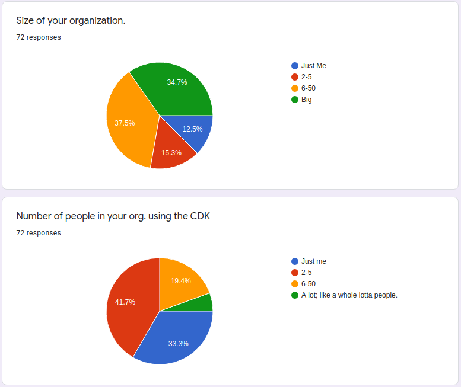
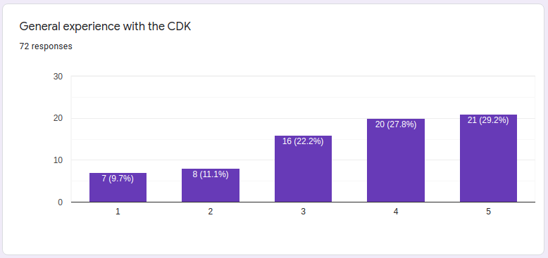
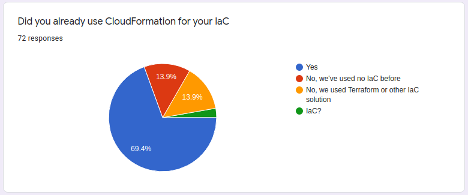
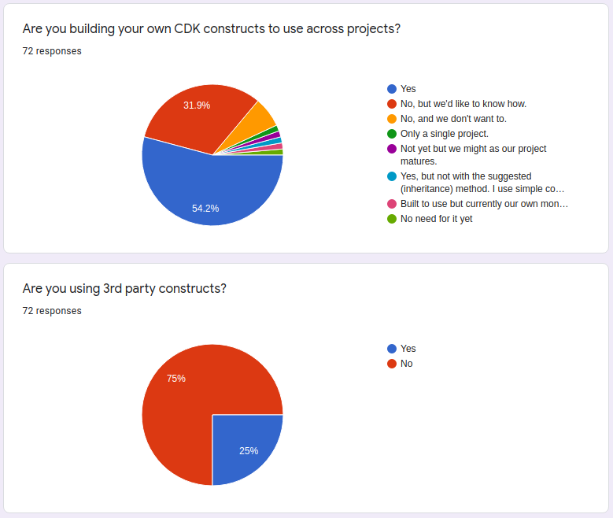
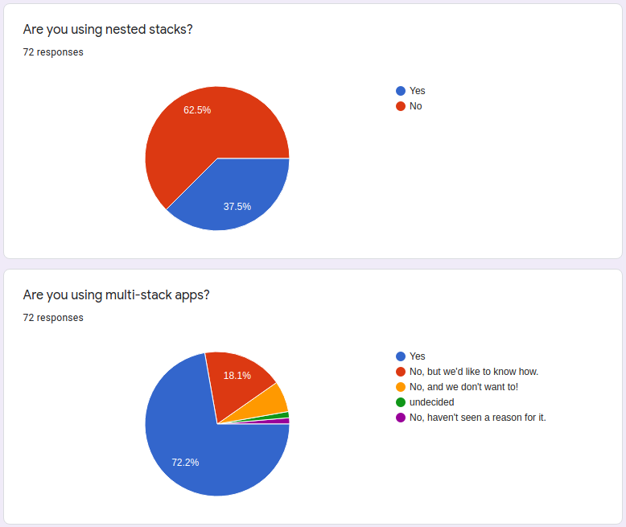
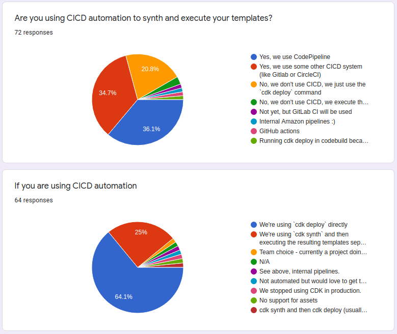
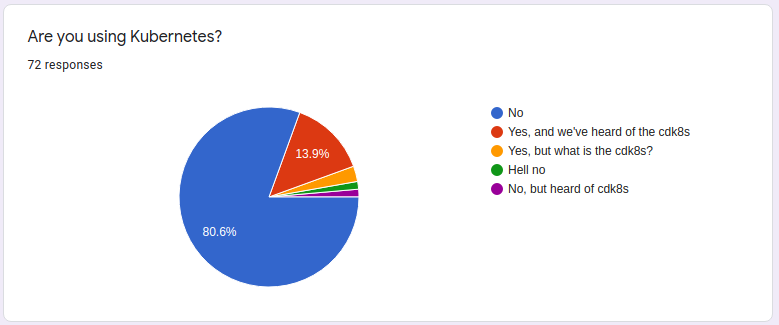
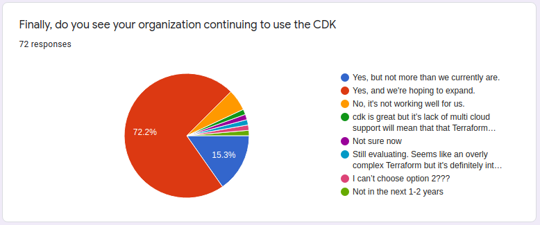

I recently sent out a survey to the community about the CDK and their use of it. The survey can be found [here](https://forms.gle/rcMMdQPHKL83w8qa8).

Let's break down the results.

# Organization size

I wanted to see if the CDK was being used at larger organizations and if it was being utilized by a large number of users
at those orgs. Nearly 75% of respondents said they were at a medium to large sized organization, which is probably to be expected. About a quarter were "small shops".
However, 1/3rd of respondents said they were the only ones using it and 75% of the usage was just to a few people.
So while larger organizations have started to adopt it that adoption is still limited.

# Experience

I wanted to know if people were still learning the CDK or were pretty experienced with it. The GA was nearly a year ago
and I wondered how comfortable everyone gauged themselves with using the CDK.
Over half of the respondents considered themselves a 4 or 5 on the scale. People are getting confident with the CDK!

# Previous Infrastructure as Code Experience

Did people jump into the CDK from CloudFormation or other IaCs? Just over 75% of people were using some previous IaC.
Personally I find this comforting. I don't think the CDK is a good start in your IaC world, but useful when you have
used other systems and want something different. Less than 15% of respondents are jumping straight into the CDK without
prior experience.

# Construct Usage

Now we're getting to the good stuff! I wanted to know how much people were using constructs, either building them for
internal use or using third parties. A lot of effort was put into the [Construct Catalog](https://github.com/construct-catalog/catalog)
and I was wondering if it had paid off.

Over 85% of respondents said they're building constructs or want to! That's a great sign, and custom constructs are the
fastest way to add value to your overall CDK adoption. However, only 25% of respondents are using 3rd party constructs.
That's actually a little higher than I would have expected but I'm hoping in 3 months we see that number go up.

# Abstractions

Beyond constructs you can abstract logic into nested stacks or multi-stack apps. Over 1/3rd of respondents said they were
using nested stacks, which honestly surprised me. I've never like nested stacks in CloudFormation and never once tried
using them in the CDK. That's not a knock on anyone who does, just wasn't expecting to be so wrong. =-}

Multi-stack usage is also higher than I expected, but in a good way. Glad to see almost 3/4s of people using them. They're
not perfect, but I like it better than nested stacks. Add in those who would like to know how and almost 90% of respondents
said they use or would like to use multi-stack apps!

# CICD and automation

Automation isn't just for application code! Over 70% of respondents said they're using some form of CICD for automating
their infrastructure deploys and this was another pleasant surprise. I was expecting that number to be under 50% based
on some conversations I had with people. I'm hoping with some pre-built constructs and better guides we could get that
number up over 80% by the end of 2020.

# Kubernetes

I added this one for fun. I almost didn't include it but I was curious. Most AWS people I've talked to are rather anti-kuberntes
as it does compete in a lot of the same tech-space as the AWS Serverless offerings. But less than 20% was lower than I
expected. However, most of those respondents having heard of the [cdk8s](https://github.com/awslabs/cdk8s) is a good sign!
For all the reasons I love the CDK I also love the cdk8s and use it for a few side projects that are running on kubernetes.
Truth is, I think the cdk8s is going to have a hard battle in taking space away from Helm.

# Continued Use

And finally, the real question: are you going to use it more or less. 87% said they will continue or expand. That's a
testament to the value that the CDK adds to organizations!

# Conclusion

A little disclaimer: I'm not an AWS employee, I'm just a CDK fanboy, but seeing these numbers gives me both hope for the product
and some hint to where it will go in the future. If the CDK is going to be here in 5 years I firmly believe it's because
of the ecosystem of constructs that people will build for it. With adoption going well for so many people I can't wait to
see next quarter's survey results.

To everyone who participated, thank you very much!
