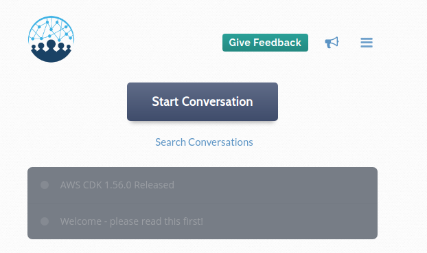

For the last few months I've been trying to be a good member of the community by being active on the
[Gitter](https://gitter.im/awslabs/aws-cdk) and on various Slack channels. But, it has become very hard to have
on-going conversations about specific issues and questions. Threads in Slack and Gitter aren't forced so they often don't
get used. Issues on Github often have good technical discussions, but isn't really the place for general questions.
I quickly scanning messages in Gitter and Slack and trying to discern if there is some way I can help or answer
questions. But lately, it feels like I'm playing whack-a-mole with unread counts more than helping.

For the CDK community to thrive I believe it will require good community interaction. This is why I originally
created the OCF, to hopefully be a central place for good information.

**I'd like to introduce you to The Open Construct Foundation's [paritions.io](https://partitions.io/cdk) board for the construct community!**

The first version of this website was... not good. I hated it from day one and launched it only to check-off a goal for 2019.
This new blog format felt better, but I knew it was always going to fall short. I've been keeping my eye open for new
options.

Back at the end of July, I got an unsolicited email about a system called partitions.io. I was mostly impressed
with the boldness and focus of the email (this isn't an email address I generally toss around). I felt the extra
effort deserved a look at the [tour](https://www.partitions.io/tour) of the product.

I think I was about 3 minutes in when I knew I wanted this. I signed up, played around and loved the feel. I replied to
[Jacob Comer](https://www.linkedin.com/in/jacobcomer/) immediately. I knew I wanted this for the CDK.

And boy, oh boy, did Jacob come through! He took some feedback and quickly made some changes to allow it to be a
community-focused product. He has graciously provided the [CDK community a board to use](https://partitions.io/cdk)!

Whether you're using the [AWS CDK](https://aws.amazon.com/cdk/), [cdk8s](https://github.com/awslabs/cdk8s), or the new
[terraform-cdk](https://github.com/hashicorp/terraform-cdk), my hope is you'll [sign up](https://partitions.io/cdk) and
contribute to the community.

Ask questions and answer others when you can. Share solutions and be kind to everyone.

Thank you.
